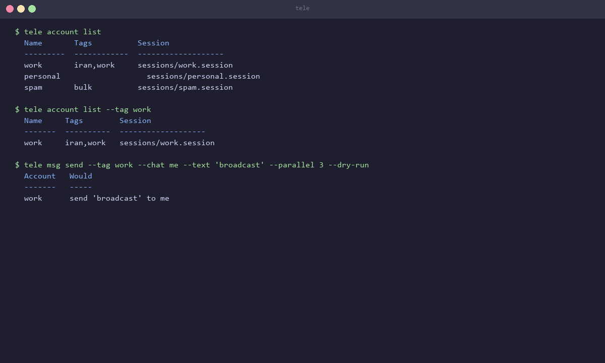
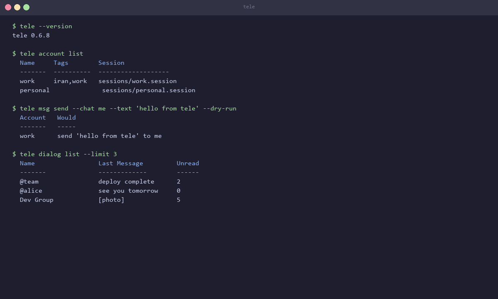
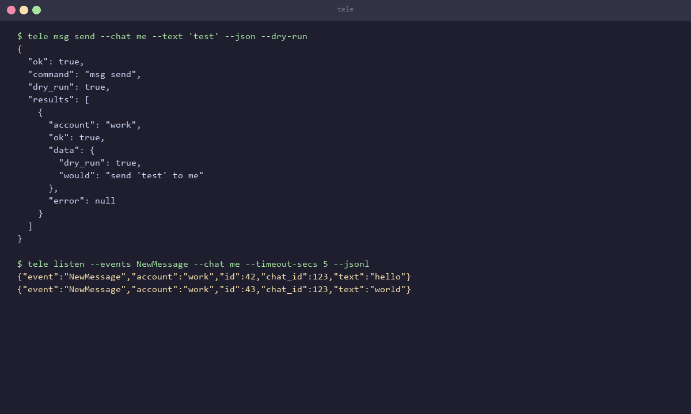

<p align="center">
  
</p>

<h3 align="center">Telegram automation from your terminal</h3>

<p align="center">
  Multi-account. Parallel. Scriptable. No bot tokens.
</p>

<p align="center">
  <a href="#install"></a>
  <a href="https://github.com/QMahyar/tele-cli/releases"></a>
  <a href="LICENSE"></a>
  <a href="https://github.com/QMahyar/tele-cli/actions"></a>
  
  
</p>

---

**Tele** drives real Telegram user accounts from the command line. Messages, chats, groups, contacts, privacy, stories, live streaming, and more. Built on [grammers](https://docs.rs/grammers-client) (MTProto). No bot tokens.

```bash
npm install -g @qmahyar/telecli
tele msg send --chat me --text "hello from tele"
```

## Why tele

| | tele | Bot API | Other CLIs |
|---|---|---|---|
| **Account type** | User account | Bot token | Varies |
| **Multi-account** | Named accounts, tags, parallel fan-out | Single bot | Single session |
| **Output** | Tables (human) + JSON/JSONL (machine) | JSON only | Tables only |
| **MCP server** | Built in (`tele mcp`) | No | No |
| **Raw TL access** | 25 typed registry entries | No | Limited |
| **Parallel** | `--parallel 1-32` with rate limiting | No | No |
| **Dry-run** | Every command, no network calls | No | Rare |

## Features

- **30+ commands** across 14 groups: accounts, messages, chats, dialogs, topics, contacts, profiles, privacy, stories, stickers, takeout, listen, serve, raw
- **Multi-account** with named sessions, tags, and parallel execution
- **JSON/JSONL output** for scripts, pipelines, and AI agents
- **MCP server** (`tele mcp`) exposes 67 tools for Claude, Cursor, and any MCP client
- **Duplex server** (`tele serve`) for embedding in scripts and applications
- **Live streaming** (`tele listen`) with event filtering, regex patterns, and album coalescence
- **Raw TL registry** for 25 typed Telegram API methods
- **Shell completions** for bash, zsh, fish, and PowerShell
- **Cross-platform**: Windows, macOS, Linux (x64, arm64, armv7, i686, riscv64, ppc64le)

### Multi-account in action

<p align="center">
  
</p>

## Demo

<p align="center">
  
</p>

## Install

### npm (recommended)

```bash
npm install -g @qmahyar/telecli
tele --version
```

Works on Windows, Linux (x64/arm64), and macOS (arm64/x64). The matching native binary installs automatically.

### Binary downloads

Grab a prebuilt binary from [Releases](https://github.com/QMahyar/tele-cli/releases). 13 targets including a static `linux-arm64-musl` build for Termux/Android.

### Build from source

Requires [Rust 1.89+](https://www.rust-lang.org/tools/install).

```bash
git clone https://github.com/QMahyar/tele-cli.git
cd tele-cli
cargo build --release
# Binary: target/release/tele (or tele.exe on Windows)
```

### Shell completions

```bash
tele completions bash >> ~/.bashrc
tele completions zsh  >> ~/.zshrc
tele completions fish > ~/.config/fish/completions/tele.fish
# PowerShell: tele completions powershell | Out-String | Invoke-Expression
```

## Quick start

### 1. Get API credentials

Go to [my.telegram.org](https://my.telegram.org), create an app, and note your `api_id` and `api_hash`.

```bash
# Create the config directory
mkdir -p ~/.config/telecli  # or %APPDATA%\telecli on Windows

# Add your credentials
echo 'TELE_API_ID=1234567' > ~/.config/telecli/.env
echo 'TELE_API_HASH=0123456789abcdef0123456789abcdef' >> ~/.config/telecli/.env
```

### 2. Add an account

```bash
tele account add --name work
tele account login --name work --method code --phone +1XXXXXXXXXX
```

Or scan a QR code:

```bash
tele account login --name work --method qr
```

### 3. Start using tele

```bash
# Send a message
tele msg send --chat me --text "hello from tele"

# List your dialogs
tele dialog list

# Get your profile
tele profile get

# Stream updates
tele listen --events NewMessage --chat me --timeout-secs 30
```

## Commands

### Accounts

| Command | Description |
|---|---|
| `tele account list` | List all configured accounts |
| `tele account add --name NAME` | Add a new account (prompts for phone) |
| `tele account login --name NAME` | Login via code or QR |
| `tele account logout --name NAME` | Logout and revoke session |
| `tele account remove --name NAME` | Remove account from config |
| `tele account status` | Show auth status |
| `tele account sessions` | List device sessions |
| `tele account password` | 2FA password management |
| `tele account export-session` | Export session for backup |
| `tele account import-session` | Import session (incl. Telethon) |
| `tele account ttl get/set` | Inactive account self-destruct timer |
| `tele account delete` | Delete account |
| `tele account phone` | Change phone number |

### Messages

| Command | Description |
|---|---|
| `tele msg send --chat TARGET --text TEXT` | Send a message |
| `tele msg send --chat TARGET --file A --file B` | Send album (2-10 files) |
| `tele msg edit --chat TARGET --id ID --text TEXT` | Edit a message |
| `tele msg delete --chat TARGET --id ID` | Delete messages |
| `tele msg forward --chat TARGET --id ID --to DEST` | Forward messages |
| `tele msg get --chat TARGET` | Get message history |
| `tele msg search --chat TARGET --query Q` | Search messages |
| `tele msg search --global --query Q` | Search all chats |
| `tele msg react --chat TARGET --id ID --emoji "👍"` | Add reaction |
| `tele msg download --chat TARGET --id ID` | Download media |
| `tele msg read --chat TARGET` | Mark as read |
| `tele msg pin --chat TARGET --id ID` | Pin/unpin message |
| `tele msg vote --chat TARGET --id ID --option 1` | Vote in poll |
| `tele msg typing --chat TARGET` | Send typing indicator |
| `tele msg click --chat TARGET --id ID --button "OK"` | Click inline button |

### Chats

| Command | Description |
|---|---|
| `tele chat join --target TARGET` | Join a chat |
| `tele chat leave --target TARGET` | Leave a chat |
| `tele chat create --title NAME` | Create group/supergroup/channel |
| `tele chat participants --target TARGET` | List members |
| `tele chat kick --target TARGET --user USER` | Kick/ban user |
| `tele chat admin --target TARGET --user USER` | Promote/demote admin |
| `tele chat admin-log --target TARGET` | Admin event log |
| `tele chat stats --target TARGET` | Channel/group statistics |
| `tele chat invite --target TARGET --user USER` | Invite user |
| `tele chat invite --target TARGET --list` | List invite links |
| `tele chat settings --target TARGET` | Read/toggle settings |
| `tele chat edit --target TARGET --title NAME` | Edit chat info |
| `tele chat link --target TARGET` | Discussion group link |

### Dialogs

| Command | Description |
|---|---|
| `tele dialog list` | List recent dialogs |
| `tele dialog drafts` | List chats with drafts |
| `tele dialog draft --chat TARGET --text TEXT` | Save/clear draft |
| `tele dialog archive --chat TARGET` | Archive/unarchive |
| `tele dialog pin --chat TARGET` | Pin/unpin dialog |
| `tele dialog delete --chat TARGET` | Remove dialog |

### Topics (Forums)

| Command | Description |
|---|---|
| `tele topic list --chat TARGET` | List forum topics |
| `tele topic create --chat TARGET --title NAME` | Create topic |
| `tele topic close --chat TARGET --topic ID` | Close topic |
| `tele topic reopen --chat TARGET --topic ID` | Reopen topic |
| `tele topic edit --chat TARGET --topic ID --title NAME` | Edit topic |
| `tele topic delete --chat TARGET --topic ID` | Delete topic |
| `tele topic pin --chat TARGET --topic ID` | Pin/unpin topic |

### Contacts

| Command | Description |
|---|---|
| `tele contact list` | List contacts |
| `tele contact add --user USER` | Add contact |
| `tele contact remove --user USER` | Remove contact |
| `tele contact block --user USER` | Block user |
| `tele contact unblock --user USER` | Unblock user |

### Profile

| Command | Description |
|---|---|
| `tele profile get` | Show your profile |
| `tele profile set --first-name NAME` | Update name |
| `tele profile set --bio TEXT` | Update bio |
| `tele profile set --username NAME` | Set/clear username |
| `tele profile photo --remove` | Remove profile photo |
| `tele profile emoji-status --emoji ID` | Set emoji status |

### Privacy

| Command | Description |
|---|---|
| `tele privacy get --key KEY` | Show privacy setting |
| `tele privacy set --key KEY --rule RULE` | Set privacy rule |

Keys: `status`, `profile_photo`, `phone_number`, `calls`, `forwards`, `chat_invite`, `added_by_phone`, `voice_messages`, `about`, `phone_p2p`, `birthday`, `star_gifts_auto_save`, `no_paid_messages`, `saved_music`

### Stories

| Command | Description |
|---|---|
| `tele story send --file PHOTO` | Post a story |
| `tele story list` | List stories |
| `tele story read --max-id ID` | Mark as read |
| `tele story delete --ids ID` | Delete story |
| `tele story pin --ids ID` | Pin/unpin story |

### Stickers

| Command | Description |
|---|---|
| `tele sticker list` | List installed packs |
| `tele sticker search --query Q` | Search sticker sets |
| `tele sticker show --set NAME` | Show pack contents |
| `tele sticker install --set NAME` | Install pack |
| `tele sticker remove --set NAME` | Remove pack |

### Live streaming

| Command | Description |
|---|---|
| `tele listen` | Stream updates as JSONL |
| `tele listen --events NewMessage,MessageEdited` | Filter event types |
| `tele listen --chat TARGET --pattern "regex"` | Filter by chat and pattern |
| `tele listen --from USER --in` | Filter by sender and direction |

### Raw TL

| Command | Description |
|---|---|
| `tele raw <method>` | Invoke any TL method |
| `tele raw <method> --args '{"key":"value"}'` | Pass parameters as JSON |

### MCP Server

| Command | Description |
|---|---|
| `tele mcp --account NAME` | Start MCP stdio server |
| `tele mcp --account NAME --read-only` | Read-only mode |
| `tele mcp --account NAME --groups msg,dialog` | Filter tool groups |

### Duplex Server

| Command | Description |
|---|---|
| `tele serve --account NAME` | Start JSONL server over stdio |

## Global flags

| Flag | Description |
|---|---|
| `--account <NAME>` | Target a specific account |
| `--tag <TAG>` | Target accounts with this tag |
| `--parallel <1-32>` | Fan out across accounts |
| `--json` | Machine-readable JSON output |
| `--jsonl` | JSON Lines output |
| `--dry-run` | Validate without network calls |
| `--config <PATH>` | Override config location |
| `-v` / `-vv` | Verbose logging (info / debug) |
| `-q` | Quiet, errors only |
| `--verbose` | Shorthand for `-v` |

## Chat targets

Most commands accept `--chat` or `--target` with these formats:

| Format | Example | Description |
|---|---|---|
| `@username` | `@team` | Public username |
| `t.me/...` | `t.me/joinchat/ABC` | Invite link |
| Numeric ID | `123456789` | Chat or user ID |
| `-100...` | `-1001234567890` | Channel ID (bot API format) |
| `me` | `me` | Your own account |
| `+phone` | `+1234567890` | Phone number (imports temporarily) |

## Configuration

Config lives at `~/.config/telecli` (Linux/macOS) or `%APPDATA%\telecli` (Windows).

### `.env` - API credentials

```
TELE_API_ID=1234567
TELE_API_HASH=0123456789abcdef0123456789abcdef
```

Get these from [my.telegram.org](https://my.telegram.org).

### `config.toml` - Accounts and settings

```toml
flood_sleep_threshold = 60
parallel_max = 3

[proxy]
type = "socks5"
host = "127.0.0.1"
port = 9050

[accounts.work]
tags = ["iran", "work"]

[accounts.work.proxy]
type = "socks5"
host = "127.0.0.1"
port = 1080

[accounts.spam]
tags = ["bulk"]
rpc_per_minute = 20.0
flood_sleep_threshold = 30
```

### Per-account options

| Key | Type | Default | Description |
|---|---|---|---|
| `flood_sleep_threshold` | `u64` | 60 | Auto-sleep threshold (seconds) |
| `rpc_per_minute` | `f64` | unlimited | Token-bucket RPC rate budget |
| `tags` | `[string]` | `[]` | Tags for `--tag` selection |
| `proxy` | table | none | Per-account SOCKS5 proxy |

## Machine output

<p align="center">
  
</p>

Every command supports `--json` for machine-readable output:

```json
{
  "ok": true,
  "command": "msg send",
  "dry_run": false,
  "results": [
    {
      "account": "work",
      "ok": true,
      "data": { "id": 42, "date": "2026-08-13T12:00:00+00:00", "text": "hello" },
      "error": null
    }
  ]
}
```

`listen` streams JSONL (one JSON object per line):

```json
{"event":"NewMessage","account":"work","id":123,"chat_id":456,"text":"hello","date":"2026-08-13T12:00:00+00:00"}
```

**Exit codes:** `0` success, `1` usage error, `2` partial failure, `3` all failed, `4` auth required, `130` interrupted.

See [docs/cli-contract.md](docs/cli-contract.md) for the full machine API reference.

## MCP integration

Tele exposes 67 tools through the Model Context Protocol for AI agents:

```bash
# Claude Desktop config
{
  "mcpServers": {
    "tele": {
      "command": "tele",
      "args": ["mcp", "--account", "work"]
    }
  }
}
```

```json
// Tool call example
{"name": "msg_send", "arguments": {"chat": "@team", "text": "deploy complete"}}
```

See [docs/cli-contract.md](docs/cli-contract.md#tele-mcp) for the full MCP tool table.

## Security

- Session files live outside the repo under the app data dir and are never logged
- One session per account with OS-level exclusive lock
- `--dry-run` honored everywhere, no network calls
- `tele raw` is full account power, treat it like your Telegram client
- API keys, phone numbers, and 2FA passwords never appear in logs or JSON output

See [docs/security.md](docs/security.md) for the full threat model.

## Development

```bash
git clone https://github.com/QMahyar/tele-cli.git
cd tele-cli
cargo build
cargo test                     # 1300+ tests, all offline
cargo clippy --all-targets -- -D warnings
cargo fmt --all -- --check
```

See [docs/CONTRIBUTING.md](docs/CONTRIBUTING.md) for architecture overview, how to add commands, and code conventions.

## Documentation

| Document | Description |
|---|---|
| [Getting Started](docs/getting-started.md) | Step-by-step setup guide |
| [Examples](docs/examples.md) | Practical usage examples |
| [Architecture](docs/architecture.md) | Codebase structure and data flow |
| [CLI Contract](docs/cli-contract.md) | Machine API reference, JSON shapes, exit codes |
| [Capabilities](docs/capabilities.md) | Feature matrix with Telegram/grammers mapping |
| [Security](docs/security.md) | Threat model, trust boundaries, permissions |
| [Contributing](docs/CONTRIBUTING.md) | Architecture, adding commands, conventions |
| [Release](docs/release.md) | Build targets, npm publishing, versioning |
| [Observability](docs/observability.md) | Logging, stderr, structured output |

## License

[MIT](LICENSE)

## Acknowledgments

Built by [QMahyar](https://github.com/QMahyar).

Powered by [grammers](https://github.com/LonamiWebs/grammers) (MTProto client for Rust).
