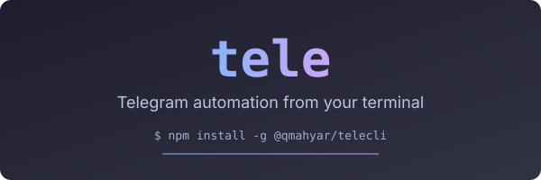

# Tele

<p align="center">
  
</p>

<p align="center">
  Telegram automation from your terminal. Multi-account. Parallel. Scriptable. No bot tokens.
</p>

<p align="center">
  <a href="https://github.com/QMahyar/tele-cli/releases"></a>
  <a href="LICENSE"></a>
  <a href="https://github.com/QMahyar/tele-cli/actions"></a>
  
</p>

---

## Install

**npm** (all platforms; the matching binary installs automatically):

```bash
npm install -g @qmahyar/telecli
```

**Binary:** download from [Releases](https://github.com/QMahyar/tele-cli/releases) — 13 targets including a static `linux-arm64-musl` build for Termux/Android.

**From source** (Rust 1.89+):

```bash
git clone https://github.com/QMahyar/tele-cli.git
cd tele-cli
cargo build --release
```

**Shell completions:**

```bash
tele completions bash >> ~/.bashrc
tele completions zsh  >> ~/.zshrc
tele completions fish > ~/.config/fish/completions/tele.fish
# PowerShell: tele completions powershell | Out-String | Invoke-Expression
```

## Quick start

**1. Get API credentials.** Create an app at [my.telegram.org](https://my.telegram.org) and save your `api_id` and `api_hash` to the config directory (`~/.config/tele` on Linux/macOS, `%APPDATA%\tele` on Windows):

```bash
mkdir -p ~/.config/tele
echo 'TELE_API_ID=1234567' > ~/.config/tele/.env
echo 'TELE_API_HASH=0123456789abcdef0123456789abcdef' >> ~/.config/tele/.env
```

**2. Add and log in an account.** `account login` prompts for the login code, or use `--method qr`:

```bash
tele account add --name work
tele account login --name work --method code --phone +1XXXXXXXXXX
```

**3. Use it.**

```bash
tele msg send --chat me --text "hello from tele"   # send yourself a message
tele dialog list                                    # recent chats
tele msg send --chat me --text "test" --dry-run     # preview, no network
```

Full walkthrough in [docs/getting-started.md](docs/getting-started.md). Usage recipes in [docs/examples.md](docs/examples.md).

---

**Tele** drives real Telegram user accounts from the command line. Built on [grammers](https://docs.rs/grammers-client) (MTProto). No bot tokens.

## What you get

- **17 command groups**: accounts, messages, chats, dialogs, forum topics, contacts, profile, privacy, stories, stickers, takeout, cache, listen, serve, mcp, raw, skill. Run `tele --help` for every command and flag (completions is the 18th utility command).
- **Multi-account**: named sessions, tags, parallel fan-out (`--parallel 1-32`) with per-account rate limiting and FloodWait handling.
- **Machine output**: every command supports `--json` and `--jsonl` with a stable envelope. `tele listen` streams events as JSONL.
- **MCP server**: `tele mcp` exposes 78 tools for Claude, Cursor, and any MCP client.
- **Duplex server**: `tele serve` runs a JSONL request/response protocol over stdin/stdout for embedding.
- **Agent skill**: `tele skill` prints a complete SKILL.md for driving tele from any coding agent.
- **Dry-run everywhere**: `--dry-run` validates and prints the exact intended action without any network call.
- **Raw TL access**: `tele raw` invokes 25 typed Telegram API methods through an allowlist.

## Multi-account

Accounts live in `config.toml` with tags. Target one account, a tag group, or all of them, and fan out in parallel:

```bash
tele msg send --account work --chat me --text "from work"
tele msg send --tag bulk --chat @channel --text "broadcast" --parallel 8
```

```toml
# ~/.config/tele/config.toml
[accounts.work]
tags = ["bulk"]

[accounts.work.proxy]
type = "socks5"
host = "127.0.0.1"
port = 1080
```

## Machine output

Every command emits one JSON envelope with per-account results:

```json
{
  "ok": true,
  "command": "msg send",
  "results": [
    { "account": "work", "ok": true, "data": { "id": 42 }, "error": null }
  ]
}
```

Exit codes: `0` success, `1` usage error, `2` partial failure, `3` all failed, `4` auth required, `130` interrupted.

Most commands accept `--chat` or `--target` as `@username`, a `t.me/` link, a numeric ID, `me`, or `+phone`.

The full JSON shapes, MCP tool table, and protocol rules are the public contract in [docs/cli-contract.md](docs/cli-contract.md). Contract changes are additive; anything else is a bug.

## For agents

Tele ships its own skill. An agent loads it into context in one command:

```bash
tele skill
```

To make it discoverable across sessions, install it into the detected agent skill directories (Claude Code, OpenCode, Cursor — or any dir with `--dir`):

```bash
tele skill install
```

The skill follows the [Agent Skills](https://agentskills.io) spec: it carries the non-negotiable usage rules (parse `--json` only, exit-code meanings, dry-run before destructive commands), the command map, the output envelope, and recipes. For deeper integration, `tele mcp` exposes the same operations as MCP tools. The project conventions for agents working *on* tele are in [AGENTS.md](AGENTS.md).

## MCP

```json
{
  "mcpServers": {
    "tele": {
      "command": "tele",
      "args": ["mcp", "--account", "work"]
    }
  }
}
```

Add `--read-only` to hide destructive tools, or `--groups msg,dialog` to filter tool groups.

## Security

- Sessions live under the OS app data directory, are permission-restricted, and hold an OS-level exclusive lock per account.
- API keys, phone numbers, and 2FA passwords are scrubbed from logs and JSON output.
- `tele raw` has full account power. Treat it like your Telegram client.

See [docs/security.md](docs/security.md) for the threat model.

## Documentation

| Document | Purpose |
|---|---|
| [Getting started](docs/getting-started.md) | Setup walkthrough and troubleshooting |
| [Examples](docs/examples.md) | Recipes for common tasks |
| [CLI contract](docs/cli-contract.md) | Machine API reference: JSON shapes, exit codes, MCP tools |
| [Architecture](docs/architecture.md) | Codebase structure and data flow |
| [Security](docs/security.md) | Threat model and trust boundaries |
| [Capabilities](docs/capabilities.md) | Feature matrix with Telegram API mapping |
| [Contributing](docs/CONTRIBUTING.md) | Adding commands, conventions, testing |
| [Observability](docs/observability.md) | Logging and output streams |
| [Release](docs/release.md) | Build targets and publishing |
| [Decisions](docs/decisions/) | Architecture decision records |
| [Changelog](CHANGELOG.md) | What's new in each release |

## License

[MIT](LICENSE). Built by [QMahyar](https://github.com/QMahyar). Powered by [grammers](https://github.com/LonamiWebs/grammers).
